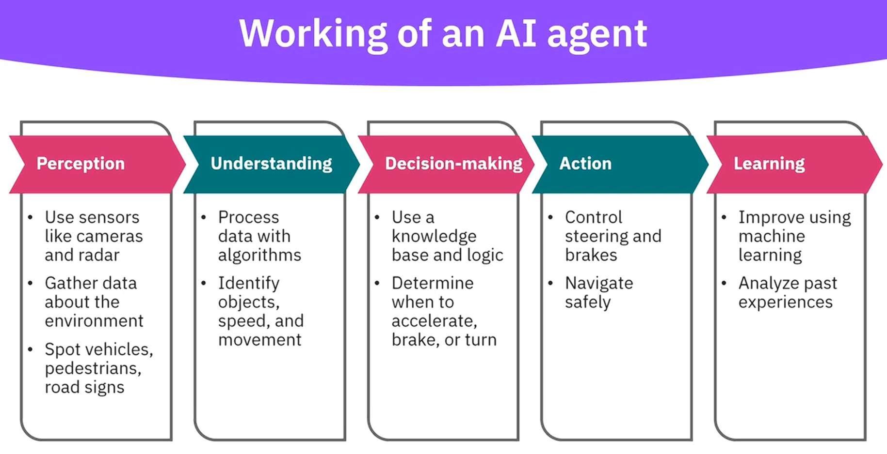

# AI agents
## Software programs that:
* Interact with their environment 
* Collect and process data
* Execute tasks on their own to achieve the goals set by humans 
* Make decisions, solve problems and adapt to new information
## Self driving cars:

## AI Agents in Youtube
* Provide content recommendation
* Analyze user behavior for video suggestions
* Detect and remove inappropriate content
* Enforce community guidelines
* Manage copyright issues

## AI Agents in Gmail
* Smart compose and smart reply features
* Suggest responses to emails
* Organize email
* Filter spam
* Identify important messages

## AI Agents in Google Maps:
* Enable real-time navigation
* Provide accurate route recommendations
* Estimate travel times
* Offer alternative routes