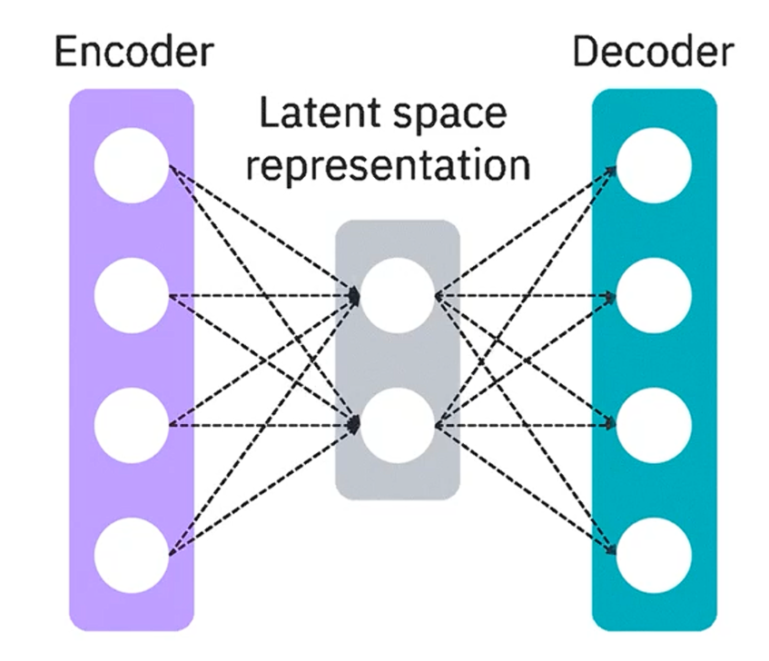
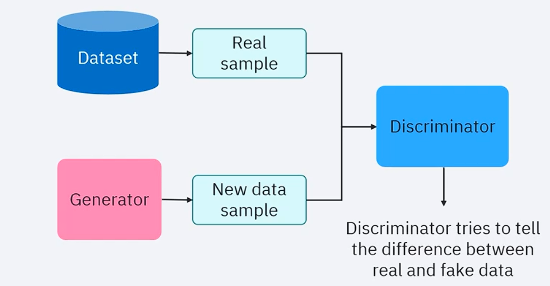
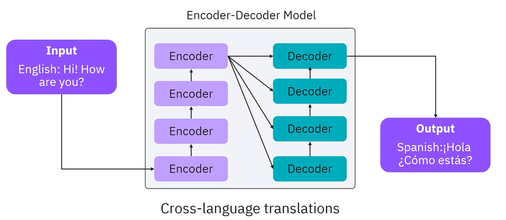

# GEN AI models architectures
## VAEs
* Encoder --> Latent space representation --> Decoder
* Encoder:
    * Converts input to latent space representation
* Latent space representation:
    * Captures key feartures of data
* Decoder:
    * Generates new outputs based on latent space representation
* Image generation, Anomaly detection, ....

## GANs
* Generator
    * Generates new data samples
    * Creates data that looks real
* Discriminator
    * Verifies generated data
    * Continous process
    * Realistic data
* Image synthesis, Style transfer, Data augmentation, StyleGAN

## Autoregressive models
* Create data sequentially:
    * Context of previously generated elements
    * Prediction of next elements in sequence
* Text, Music (WaveNet), ...
## Transformers
* NLP tasks
* Encoder/ decoder layers
* Text sequences

